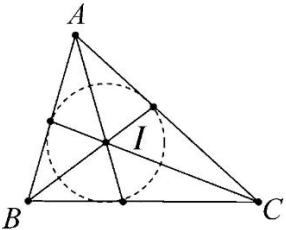

## 3. 三角形的内心

<table><tr><td rowspan="4">三角形内心</td><td>定义</td><td colspan="2">图形</td><td>性质</td></tr><tr><td>三角形的三条内角平分线交于一点,这点称为三角形的内心(内切圆圆心)</td><td colspan="2"></td><td>1. 三角形的内心到三边的距离相等,都等于三角形内切圆半径2. 直角三角形的内心到边的距离等于两直角边的和减去斜边的差的二分之一</td></tr><tr><td colspan="4">内心的向量式表示</td></tr><tr><td colspan="4">设O是△ABC的内心,P为平面内任意一点1若AB=c,AC=b,BC=a,则且aOA+bOB+cOC=02若AP=λ((AB/|AB|+AC/|AC|),λ∈(0,+∞),则动点P的轨迹一定通过△ABC的内心.3若AB=c,AC=b,BC=a,且OA=bAB+cAC.4若AB=c,AC=b,BC=a,且PO=aPA+bPB+cPC.</td></tr></table>

内心向量式证明：

证明①:

因为 $\overrightarrow{OB} = \overrightarrow{OA} +\overrightarrow{AB},\overrightarrow{OC} = \overrightarrow{OA} +\overrightarrow{AC}$ ，则由题意知 $(a + b + c)\overrightarrow{OA} +b\overrightarrow{AB} +c\overrightarrow{AC} = 0$ ，因为 $b\overrightarrow{AB} +c\overrightarrow{AC} = |\overrightarrow{AC} |\cdot \overrightarrow{AB} +|\overrightarrow{AB} |\cdot \overrightarrow{AC} = |\overrightarrow{AC} |\cdot |\overrightarrow{AB} |\cdot \left(\frac{\overrightarrow{AB}}{|\overrightarrow{AB}|} +\frac{\overrightarrow{AC}}{|\overrightarrow{AC}|}\right).$

所以 $\overrightarrow{AO}=\frac{bc}{a+b+c}\left(\frac{\overrightarrow{AB}}{|\overrightarrow{AB}|}+\frac{\overrightarrow{AC}}{|\overrightarrow{AC}|}\right)$ . 因为 $\frac{\overrightarrow{AB}}{|\overrightarrow{AB}|}$ 与 $\frac{\overrightarrow{AC}}{|\overrightarrow{AC}|}$ 分别为 $\overrightarrow{AB}$ 和 $\overrightarrow{AC}$ 方向上的单位向量, 所以 $\overrightarrow{AO}$ 与 $\angle BAC$ 的平分线共线, 即 AO 平分 $\angle BAC$ . 同理 BO 平分 $\angle ABC, CO$ 平分 $\angle ACB$ . 从而 O 是 $\triangle ABC$ 的内心.
证明②:

设 $\frac{\overrightarrow{AB}}{|\overrightarrow{AB}|}$ 为 $\overrightarrow{AB}$ 上的单位向量， $\frac{\overrightarrow{AC}}{|\overrightarrow{AC}|}$ 为 $\overrightarrow{AC}$ 上的单位向量，则 $\frac{\overrightarrow{AB}}{|\overrightarrow{AB}|} + \frac{\overrightarrow{AC}}{|\overrightarrow{AC}|}$ 的方向为 $\angle BAC$ 的角平分线 $\overrightarrow{AD}$ 的方向，又 $\lambda \in (0, +\infty)$ ，所以 $\lambda \left(\frac{\overrightarrow{AB}}{|\overrightarrow{AB}|} + \frac{\overrightarrow{AC}}{|\overrightarrow{AC}|}\right)$ 的方向与 $\frac{\overrightarrow{AB}}{|\overrightarrow{AB}|} + \frac{\overrightarrow{AC}}{|\overrightarrow{AC}|}$ 方向相同，而 $\overrightarrow{AP} = \lambda \left(\frac{\overrightarrow{AB}}{|\overrightarrow{AB}|} + \frac{\overrightarrow{AC}}{|\overrightarrow{AC}|}\right)$ . 所以点 $P$ 在 $\overrightarrow{AD}$ 上移动， $P$ 点的轨迹一定通过 $\triangle ABC$ 的内心.

证明③:

$\overrightarrow{OA} = \frac{b\overrightarrow{AB} + c\overrightarrow{AC}}{a + b + c} = \frac{bc}{a + b + c}\left(\frac{\overrightarrow{AB}}{|\overrightarrow{AB}|} +\frac{\overrightarrow{AC}}{|\overrightarrow{AC}|}\right)$ ，根据①的证明过程可得 $\overrightarrow{OA}$ 在 $\angle BAC$ 的角平分线上，同理 $\overrightarrow{OB}$ 在 $\angle ABC$ 的角平分线上，所以点 $O$ 为三角形 $ABC$ 的角平分线的交点，故点 $O$ 是三角形的内心.

证明④:

因为 $\overrightarrow{PO} = \frac{a\overrightarrow{PA} + b\overrightarrow{PB} + c\overrightarrow{PC}}{a + b + c}$

则 $(a + b + c)\overrightarrow{PO} = a\overrightarrow{PA} +b\overrightarrow{PB} +c\overrightarrow{PC}$ ，即 $a\overrightarrow{PO} +b\overrightarrow{PO} +c\overrightarrow{PO} = a\overrightarrow{PA} +b\overrightarrow{PB} +c\overrightarrow{PC}$

移项可得 $a\overrightarrow{PA}-a\overrightarrow{PO}+b\overrightarrow{PB}-b\overrightarrow{PO}+c\overrightarrow{PC}-c\overrightarrow{PO}=\vec{0}$

即 $a\left(\overrightarrow{PA} -\overrightarrow{PO}\right) + b\left(\overrightarrow{PB} -\overrightarrow{PO}\right) + c\left(\overrightarrow{PC} -\overrightarrow{PO}\right) = \vec{0}$

则 $a\overrightarrow{OA} + b\overrightarrow{OB} + c\overrightarrow{OC} = \vec{0}$ ,

根据①的证明过程得证.
