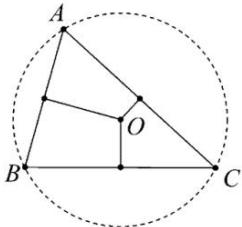

## 4. 三角形的外心

<table><tr><td rowspan="4">三角形外心</td><td>定义</td><td>图形</td><td>性质</td></tr><tr><td>三角形的三条边的垂直平分线交于一点,这点称为三角形的外心(外接圆圆心)</td><td></td><td>1.三角形的外心到三角形的三个顶点距离相等.都等于三角形的外接圆半径2.锐角三角形的外心在三角形内;直角三角形的外心在斜边中点;钝角三角形的外心在三角形外</td></tr><tr><td colspan="3">外心的向量式表示</td></tr><tr><td colspan="3">设O是△ABC的外心,P为平面内任意一点1 $\overrightarrow{OA^2}=\overrightarrow{OB^2}=\overrightarrow{OC^2}$ 2 $(\overrightarrow{OA}+\overrightarrow{OB})\cdot\overrightarrow{AB}=(\overrightarrow{OB}+\overrightarrow{OC})\cdot\overrightarrow{BC}=(\overrightarrow{OA}+\overrightarrow{OC})\cdot\overrightarrow{AC}=0$ 3 $\overrightarrow{OP}=\frac{\overrightarrow{OB}+\overrightarrow{OC}}{2}+\lambda\left(\frac{\overrightarrow{AB}}{|\overrightarrow{AB}|\cos B}+\frac{\overrightarrow{AC}}{|\overrightarrow{AC}|\cos C}\right),\lambda\in(0,+\infty)$ 则动点P的轨迹一定通过△ABC的外心.</td></tr></table>

外心向量式证明：

证明①:

$\overrightarrow{OA^{2}}=\overrightarrow{OB^{2}}=\overrightarrow{OC^{2}}$ ，知 $|\overrightarrow{OA}|^{2}=|\overrightarrow{OB}|^{2}=|\overrightarrow{OC}|^{2}$ ，所以 $|\overrightarrow{OA}|=|\overrightarrow{OB}|=|\overrightarrow{OC}|$ ，则O是 $\triangle ABC$ 的外心.
证明②:

由 $(\overrightarrow{OA} + \overrightarrow{OB}) \cdot \overrightarrow{AB} = 0$ 得: $(\overrightarrow{OA} + \overrightarrow{OB}) \cdot (\overrightarrow{OB} - \overrightarrow{OA}) = 0$ , 即 $\overrightarrow{OB}^2 - \overrightarrow{OA}^2 = 0$ , 则有 $|\overrightarrow{OA}| = |\overrightarrow{OB}|$ 由 $(\overrightarrow{OA} + \overrightarrow{OC}) \cdot \overrightarrow{AC} = 0$ , 同理可得 $|\overrightarrow{OA}| = |\overrightarrow{OC}|$ , 因此 $|\overrightarrow{OA}| = |\overrightarrow{OB}| = |\overrightarrow{OC}|$ , 所以 $O$ 是 $\triangle ABC$ 的外心.

证明③:

设 $B, C$ 中点为 $M$ , 则 $\frac{\overrightarrow{OB} + \overrightarrow{OC}}{2} = \overrightarrow{OM}$ , 又 $\overrightarrow{OP} = \frac{\overrightarrow{OB} + \overrightarrow{OC}}{2} + \lambda \left( \frac{\overrightarrow{AB}}{|\overrightarrow{AB}| \cos B} + \frac{\overrightarrow{AC}}{|\overrightarrow{AC}| \cos C} \right)$ , 所以 $\overrightarrow{MP} = \lambda \left( \frac{\overrightarrow{AB}}{|\overrightarrow{AB}| \cos B} + \frac{\overrightarrow{AC}}{|\overrightarrow{AC}| \cos C} \right)$ , $\overrightarrow{MP} \cdot \overrightarrow{BC} = \lambda \left( \frac{\overrightarrow{AB} \cdot \overrightarrow{BC}}{|\overrightarrow{AB}| \cos B} + \frac{\overrightarrow{AC} \cdot \overrightarrow{BC}}{|\overrightarrow{AC}| \cos C} \right) = \lambda [|\overrightarrow{BC}| \cdot (-1) + |\overrightarrow{BC}|] = 0$ , 即 $\overrightarrow{MP} \perp \overrightarrow{BC}$ , 故动点 $P$ 的轨迹一定通过 $\triangle ABC$ 的外心.
