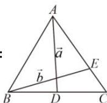

> [!faq]- 全练一本通解析
> **【答案】** D
>
> **【解析】**
> 解析：
> 
> 由题知 $\vec{a}=\overrightarrow{AB}+\frac{1}{2}\overrightarrow{BC}$ ①, $\vec{b}=\overrightarrow{BA}+\frac{2}{3}\overrightarrow{AC}=\overrightarrow{BA}+\frac{2}{3}\left(\overrightarrow{BC}-\overrightarrow{BA}\right)=\frac{1}{3}\overrightarrow{BA}+\frac{2}{3}\overrightarrow{BC}$ ②,
> - **①**：+3×②得 $\vec{a}+3\vec{b}=\frac{5}{2}\overrightarrow{BC}$ ，故 $\overrightarrow{BC}=\frac{2}{5}\vec{a}+\frac{6}{5}\vec{b}$ .
>
> 故选 **D**.
