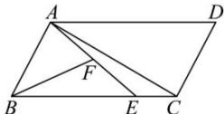

> [!faq]- 全练一本通解析
> **【答案】** A
>
> **【解析】**
> 解析：∵点F为线段AE的中点，
> ∴ $\overrightarrow{BF}=\frac{1}{2}\overrightarrow{BA}+\frac{1}{2}\times\frac{3}{4}\overrightarrow{BC}=\frac{1}{2}\overrightarrow{BA}+\frac{3}{8}(\overrightarrow{AC}-\overrightarrow{AB})=-\frac{7}{8}\overrightarrow{AB}+\frac{3}{8}\overrightarrow{AC}$ 即 $8\overrightarrow{BF} = -7\overrightarrow{AB} + 3\overrightarrow{AC}$ ①,
> ∵ $\overrightarrow{BE} = 3\overrightarrow{EC}$ ,
> ∴ $\overrightarrow{AE} = \overrightarrow{AB} + \frac{3}{4}\overrightarrow{BC} = \overrightarrow{AB} + \frac{3}{4} (\overrightarrow{AC} - \overrightarrow{AB}) = \frac{1}{4}\overrightarrow{AB} + \frac{3}{4}\overrightarrow{AC}$ 即 $4\overrightarrow{AE} = \overrightarrow{AB} + 3\overrightarrow{AC}$ ②，
> 由①②得， $\overrightarrow{AC}=\frac{7}{6}\overrightarrow{AE}+\frac{1}{3}\overrightarrow{BF}=\frac{7}{6}\overrightarrow{AE}-\frac{1}{3}\overrightarrow{FB}$ ，故选：A.
> 
