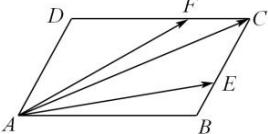

> [!faq]- 全练一本通解析
> **【答案】** B
>
> **【解析】**
> $\frac{3}{7}\vec{a}+\frac{6}{7}\vec{b}$ 解析：因为四边形 ABCD 为平行四边形，所以 $\overline{{AC}}=\overline{{AB}}+\overline{{AD}},\quad\overline{{BC}}=\overline{{AD}},\quad\overline{{DC}}=\overline{{AB}}$ 因为 $\overline{{BE}}=\frac{1}{2}\overline{{EC}},\quad\overline{{DF}}=2\overline{{FC}}$ 所以 $\overline{{BE}}=\frac{1}{3}\overline{{BC}},\quad\overline{{DF}}=\frac{2}{3}\overline{{DC}}$ 所以 $\overline{{AE}}=\overline{{AB}}+\overline{{BE}}=\overline{{AB}}+\frac{1}{3}\overline{{BC}}=\overline{{AB}}+\frac{1}{3}\overline{{AD}}$ $\overline{{AF}}=\overline{{AD}}+\overline{{DF}}=\overline{{AD}}+\frac{2}{3}\overline{{DC}}=\overline{{AD}}+\frac{2}{3}\overline{{AB}}$ 因为 $\overline{{AE}}=\vec{a},\quad\overline{{AF}}=\vec{b},$
> 所以 $\left\{\begin{aligned}\overrightarrow{AB}+\frac{1}{3}\overrightarrow{AD}=\vec{a}\\ \overrightarrow{AD}+\frac{2}{3}\overrightarrow{AB}=\vec{b}\end{aligned}\right.$ ，解得 $\left\{\begin{aligned}\overrightarrow{AB}=\frac{9}{7}\vec{a}-\frac{3}{7}\vec{b}\\ \overrightarrow{AD}=\frac{9}{7}\vec{b}-\frac{6}{7}\vec{a}\end{aligned}\right.$
> 所以 $\overrightarrow{AC} = \overrightarrow{AB} +\overrightarrow{AD} = \frac{9}{7}\vec{a} -\frac{3}{7}\vec{b} +\frac{9}{7}\vec{b} -\frac{6}{7}\vec{a} = \frac{3}{7}\vec{a} +\frac{6}{7}\vec{b}$ ，故选：B.
> 
