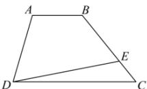

<!-- question-source:start -->
【13】（2023·湖北高二联考）如图, 在四边形 ABCD 中, $\overrightarrow{DC}=2\overrightarrow{AB}$ , $\overrightarrow{BE}=2\overrightarrow{EC}$ , 设 $\overrightarrow{DC}=\vec{a}$ , $\overrightarrow{DA}=\vec{b}$ , 则 $\overrightarrow{DE}$ 等于（）

A. $\frac{5}{6}\vec{a} +\frac{1}{2}\vec{b}$ B. $\frac{2}{3}\vec{a} +\frac{1}{2}\vec{b}$ C. $\frac{5}{6}\vec{a} +\frac{1}{3}\vec{b}$ D. $\frac{2}{3}\vec{a} +\frac{1}{3}\vec{b}$
<!-- question-source:end -->

![[Q00009147A1]]
