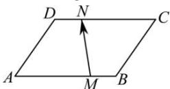

<!-- question-source:start -->
【20】(2023·石家庄高三联考)如图,在平行四边形ABCD中, $\overrightarrow{AM}=\lambda\overrightarrow{MB},\overrightarrow{DN}=\mu\overrightarrow{NC},(\lambda,\mu\in\mathbb{R})$ ,若 $\overrightarrow{MN}=-\frac{1}{3}\overrightarrow{AB}+\overrightarrow{AD}$ ,则下列关系正确的是()

A. $\frac{1}{\mu + 1} - \frac{1}{\lambda + 1} = \frac{1}{3}$ B. $\mu - \lambda = 3$ C. $\frac{1}{\lambda + 1} - \frac{1}{\mu + 1} = \frac{1}{3}$ D. $\lambda - \mu = 3$
<!-- question-source:end -->

![[Q00009154A1]]
