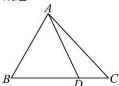

> [!faq]- 全练一本通解析
> **【答案】** A
>
> **【解析】**
> 解析： $\overrightarrow{AD} = \overrightarrow{AB} +\overrightarrow{BD} = \overrightarrow{AB} +\frac{3}{4}\overrightarrow{BC} = \overrightarrow{AB} +\frac{3}{4}\left(\overrightarrow{AC} -\overrightarrow{AB}\right) = \frac{1}{4}\overrightarrow{AB} +\frac{3}{4}\overrightarrow{AC}$
> 故选:A
> 
