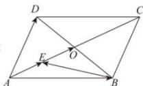

> [!faq]- 全练一本通解析
> **【答案】** A
>
> **【解析】**
> 解析：
> 
> 由已知对角线 AC 与 BD 交于点 O， $\overrightarrow{AO}=2\overrightarrow{AE}$
> 则 $\overrightarrow{AE} = \frac{1}{4}\overrightarrow{AC} = \frac{1}{4}\left(\overrightarrow{AB} +\overrightarrow{AD}\right) = \frac{1}{4}\overrightarrow{AB} +\frac{1}{4}\overrightarrow{AD},$
> 所以 $\overrightarrow{BE} = \overrightarrow{AE} -\overrightarrow{AB} = \frac{1}{4}\overrightarrow{AB} +\frac{1}{4}\overrightarrow{AD} -\overrightarrow{AB} = -\frac{3}{4}\overrightarrow{AB} +\frac{1}{4}\overrightarrow{AD}$ ，
>
> 故选 **A**.
