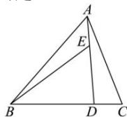

> [!faq]- 全练一本通解析
> **【答案】** C
>
> **【解析】**
> 解析: 因为 $\overrightarrow{BD}=3\overrightarrow{DC}$
> $$
> \overrightarrow {A D} = \overrightarrow {A B} + \overrightarrow {B D} = \overrightarrow {A B} + \frac {3}{4} \overrightarrow {B C} = \overrightarrow {A B} + \frac {3}{4} (\overrightarrow {A C} - \overrightarrow {A B}) = \frac {1}{4} \overrightarrow {A B} + \frac {3}{4} \overrightarrow {A C}
> $$
> 又 $\overrightarrow{AD} = 3\overrightarrow{AE}$ ，所以 $\overrightarrow{AE} = \frac{1}{3}\overrightarrow{AD} = \frac{1}{3}\cdot \left(\frac{1}{4}\overrightarrow{AB} +\frac{3}{4}\overrightarrow{AC}\right),$
> 所以 $\overrightarrow{BE} = \overrightarrow{AE} -\overrightarrow{AB} = \frac{1}{3}\left(\frac{1}{4}\overrightarrow{AB} +\frac{3}{4}\overrightarrow{AC}\right) - \overrightarrow{AB} = \frac{1}{4}\overrightarrow{AC} -\frac{11}{12}\overrightarrow{AB}$
> 故选:C
> 
