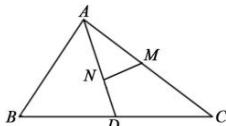

> [!faq]- 全练一本通解析
> **【答案】** D
>
> **【解析】**
> 解析: 因为 AN = 2ND，所以 $\overrightarrow{AN} = \frac{2}{3} \overrightarrow{AD}$ ，
> 又点 D 是 BC 的中点，点 M 是 AC 的中点，所以 $\overrightarrow{AM} = \frac{1}{2} \overrightarrow{AC}, \overrightarrow{BD} = \frac{1}{2} \overrightarrow{BC}$ ，
> 故 $\overrightarrow{MN} = \overrightarrow{AN} - \overrightarrow{AM} = \frac{2}{3} \overrightarrow{AD} - \frac{1}{2} \overrightarrow{AC} = \frac{2}{3} \left( \overrightarrow{AB} + \frac{1}{2} \overrightarrow{BC} \right) - \frac{1}{2} \left( \overrightarrow{AB} + \overrightarrow{BC} \right) = \frac{1}{6} \overrightarrow{AB} - \frac{1}{6} \overrightarrow{BC}$ . 故选：D.
> 
