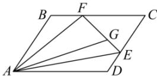

> [!faq]- 全练一本通解析
> **【答案】** C
>
> **【解析】**
> 解析:如图所示,
> 
> 由题意, 得 $\overrightarrow{EC}=2\overrightarrow{DE}$ , $\overrightarrow{FC}=2\overrightarrow{BF}$ ,
> 所以 $\overrightarrow{FE}=\overrightarrow{FC}+\overrightarrow{CE}=\frac{2}{3}\overrightarrow{BC}-\frac{2}{3}\overrightarrow{DC}=\frac{2}{3}\overrightarrow{AD}-\frac{2}{3}\overrightarrow{AB}$ ，又 $\overrightarrow{FG}=2\overrightarrow{GE}$ ， $\overrightarrow{AG}=\overrightarrow{AB}+\overrightarrow{BF}+\overrightarrow{FG}=\overrightarrow{AB}+\frac{1}{3}\overrightarrow{AD}+\frac{2}{3}\overrightarrow{FE}=\overrightarrow{AB}+\frac{1}{3}\overrightarrow{AD}+\frac{2}{3}\left(\frac{2}{3}\overrightarrow{AD}-\frac{2}{3}\overrightarrow{AB}\right)$ $=\frac{5}{9}\overrightarrow{AB}+\frac{7}{9}\overrightarrow{AD}$
>
> 故选 **C**.
