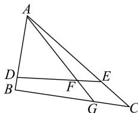

<!-- question-source:start -->
【40】(难)如图, 在 $\triangle ABC$ 中, $\overrightarrow{BG}=2\overrightarrow{GC}$ , $\overrightarrow{AF}=3\overrightarrow{FG}$ . 过点 F 的直线与边 AB, AC 分别交于点 D, E. 设 $\overrightarrow{DB}=\lambda\overrightarrow{AD}$ , $\overrightarrow{EC}=\mu\overrightarrow{AE}$ , 其中 $\lambda,\mu>0$ .

（1）试用 $\overrightarrow{AG}$ 与 $\overrightarrow{BC}$ 表示 $\overrightarrow{AB},\overrightarrow{AC}$ ；

(2) 证明 $\lambda + 2\mu$ 为定值, 并求此定值.

<!-- question-source:end -->

![[Q00009174A1]]
