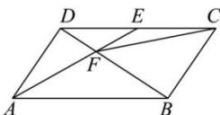

<!-- question-source:start -->
【17】如图, 在平行四边形 ABCD 中, E 是 CD 的中点, AE 和 BD 相交于点 F. 记 $\overrightarrow{AB} = \overrightarrow{a}$ , $\overrightarrow{AD} = \overrightarrow{b}$ , 则（）

A. $\overrightarrow{CF} = -\frac{2}{3}\vec{a} -\frac{1}{3}\vec{b}$ B. $\overrightarrow{CF} = \frac{2}{3}\vec{a} +\frac{1}{3}\vec{b}$ C. $\overrightarrow{CF} = -\frac{1}{3}\vec{a} -\frac{2}{3}\vec{b}$ D. $\overrightarrow{CF} = \frac{1}{3}\vec{a} +\frac{2}{3}\vec{b}$
<!-- question-source:end -->

![[Q00004816A1]]
