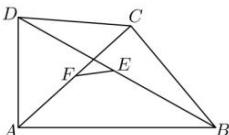

<!-- question-source:start -->
【18】(2023·安徽滁州高一期末)如图,在平面四边形ABCD中,E,F分别为BD和AC的中点,那么()

A. $\overrightarrow{EF} = \frac{1}{2}\overrightarrow{AB} +\frac{1}{2}\overrightarrow{DC}$ B. $\overrightarrow{EF} = \frac{1}{2}\overrightarrow{AB} -\frac{1}{2}\overrightarrow{DC}$ C. $\overrightarrow{EF} = -\frac{1}{2}\overrightarrow{AB} +\frac{1}{2}\overrightarrow{DC}$ D. $\overrightarrow{EF} = -\frac{1}{2}\overrightarrow{AB} -\frac{1}{2}\overrightarrow{DC}$
<!-- question-source:end -->

![[Q00004817A1]]
