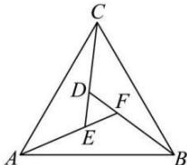

<!-- question-source:start -->
【23】(2023·天津南开中学校考阶段练习) $\triangle ABC$ 是由3个全等的三角形与中间一个小等边三角形拼成的一个较大的等边三角形, 若 $\overrightarrow{AF}=3\overrightarrow{EF}$ , $\left|\overrightarrow{AF}\right|=3$ , 且 $\overrightarrow{AF}=\lambda\overrightarrow{AB}+\mu\overrightarrow{AC}$ , 则 $\lambda+\mu=$ ( )

A. $\frac{15}{19}$ B. $\frac{6}{19}$ C. $\frac{9}{19}$ D. $\frac{4\sqrt{19}}{19}$
<!-- question-source:end -->

![[Q00004822A1]]
