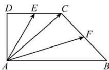

<!-- question-source:start -->
【27】（2023·贵州遵义高二校考）如图，在梯形ABCD中， $AB \parallel DC$ ，AB = 2DC，E，F分别为DC，CB的中点，试用 $\overrightarrow{AE}$ 与 $\overrightarrow{AF}$ 表示 $\overrightarrow{AC}$ .

<!-- question-source:end -->

![[Q00004826A1]]
