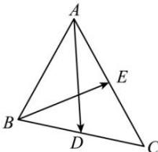

<!-- question-source:start -->
【28】已知 $AD, BE$ 分别为 $\triangle ABC$ 的边 $BC, AC$ 上的中线，设 $\overrightarrow{AD} = \overrightarrow{a}$ ， $\overrightarrow{BE} = \overrightarrow{b}$ ，试用 $\overrightarrow{a}$ 与 $\overrightarrow{b}$ 表示 $\overrightarrow{BC}$ .

<!-- question-source:end -->

![[Q00004827A1]]
