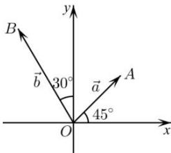

<!-- question-source:start -->
【7】(2022·高一课时练习)在平面直角坐标系 $xOy$ 中, 向量 $\vec{a}$ , $\vec{b}$ 的方向如图所示, 且 $\left|\vec{a}\right| = 2$ , $\left|\vec{b}\right| = 3$ , 求 $\vec{a}$ 与 $\vec{b}$ 的坐标.

<!-- question-source:end -->

![[Q00004946A1]]
