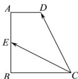

<!-- question-source:start -->
【32】（2023·河北高三）如图，在直角梯形 ABCD 中， $AD \parallel BC$ ， $AB \perp BC$ ，AB = BC = 2，AD = 1，点 E 在边 AB 上，且 $\overrightarrow{CD} \cdot \overrightarrow{CE} = 3$ ，则 BE = （）

A. 1 B. 2 C. $\frac{1}{2}$ D. $\frac{3}{2}$
<!-- question-source:end -->

![[Q00009307A1]]
