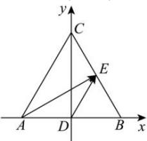

> [!faq]- 全练一本通解析
> **【答案】** B
>
> **【解析】**
> $\frac{3}{2}$
> 解析:由题知, D 为 AB 中点, E 为 BC 中点, 连接 CD, 以 D 为坐标原点, 分别以 AD, DC 所在的直线为 x 轴, y 轴建立如图所示的平面直角坐标系,
> 则 $A(-1,0)$ ， $B(1,0)$ ， $C(0,\sqrt{3})$ ， $D(0,0)$ ， $E\left(\frac{1}{2},\frac{\sqrt{3}}{2}\right)$ ，
> 所以 $\overrightarrow{AE} = \left(\frac{3}{2},\frac{\sqrt{3}}{2}\right)$ ， $\overrightarrow{DE} = \left(\frac{1}{2},\frac{\sqrt{3}}{2}\right)$ 故 $\overrightarrow{AE}\cdot \overrightarrow{DE} = \frac{3}{2}$ .故选：B
> 
