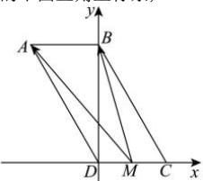

> [!faq]- 全练一本通解析
> **【答案】** $\frac{15}{4}$
>
> **【解析】**
> $BD \perp DC$ ，以 D 为原点，DC 为 x 轴，DB 为 y 轴，建立如图所示的平面直角坐标系，
> 
> $AD = 2AB = 2$ ，则 $BD = \sqrt{AD^2 - AB^2} = \sqrt{4 - 1} = \sqrt{3}$ 有 $M\left(\frac{1}{2},0\right),B(0,\sqrt{3}),A(-1,\sqrt{3}),\overrightarrow{MA} = \left(-\frac{3}{2},\sqrt{3}\right),\overrightarrow{MB} = \left(-\frac{1}{2},\sqrt{3}\right)$ $\overrightarrow{MA}\cdot \overrightarrow{MB} = \frac{3}{4} +3 = \frac{15}{4}$ .故答案为： $\frac{15}{4}$
