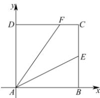

> [!faq]- 全练一本通解析
> **【答案】** D
>
> **【解析】**
> 解析:如图,建立平面直角坐标系,设 $|DF|=a\in[0,4]$
> 
> 则 $A(0,0), E(4,2), F(a,4)$ ，可得 $\overrightarrow{AF} = (a,4), \overrightarrow{AE} = (4,2)$ ，因为 $\overrightarrow{AF} \cdot \overrightarrow{AE} = |\overrightarrow{AE}|^2$ ，即 $4a + 8 = 20$ ，解得 $a = 3$ ，即 $\overrightarrow{AF} = (3,4)$ ，所以 $|AF| = |\overrightarrow{AF}| = \sqrt{3^2 + 4^2} = 5$ 。
>
> 故选 **D**。
