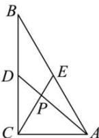

<!-- question-source:start -->
【54】（2023·北京顺义高一期中）如图, 在 $\triangle ABC$ 中, AC = 1, AB = 2, $\angle BAC = 60^{\circ}$ , BC, AB 边上的两条中线 AD, CE 相交于点 P, 则 $\cos \angle DPE = (\quad)$

A. $\frac{3\sqrt{21}}{14}$ B. $\frac{\sqrt{21}}{7}$ C. $\frac{1}{7}$ D. $\frac{\sqrt{7}}{14}$
<!-- question-source:end -->

![[Q00009329A1]]
