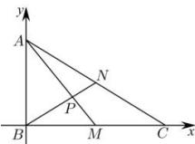

> [!faq]- 全练一本通解析
> **【答案】** B
>
> **【解析】**
> 解析:由余弦定理得 $BC=\sqrt{4+16-2\times2\times4\times\cos60^{\circ}}=2\sqrt{3}$ 所以 $AB^{2} + BC^{2} = AC^{2}$ ，所以三角形 ABC 是直角三角形，且 $\angle ABC = 90^{\circ}$ ，以 B 为原点建立如图所示平面直角坐标系， $A(0,2),M(\sqrt{3},0),C(2\sqrt{3},0),N(\sqrt{3},1)$ , $\overrightarrow{MA}=\left(-\sqrt{3},2\right),\overrightarrow{NB}=\left(-\sqrt{3},-1\right)$ , $\angle MPN = \angle APB = \overrightarrow{MA}, \overrightarrow{NB}$ 所以 $\cos\angle MPN=\cos\overrightarrow{MA},\overrightarrow{NB}=\frac{\overrightarrow{MA}\cdot\overrightarrow{NB}}{\left|\overrightarrow{MA}\right|\cdot\left|\overrightarrow{NB}\right|}=\frac{1}{\sqrt{7}\times2}=\frac{\sqrt{7}}{14}$ . 故选：B
> 
> $$
> \text {
