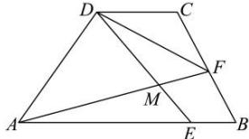

<!-- question-source:start -->
【63】(难)如图, 梯形 ABCD 中, $AB \parallel CD$ , AB = 5, AD = 2DC = 4, 且 $\overrightarrow{AC} \cdot \overrightarrow{BD} = 0$ , E 是线段 AB 上一点, 且 AE = 4EB, F 为线段 BC 上一动点.

（1）求 $\angle DAB$ 的大小；

（2）若 $F$ 为线段 $BC$ 的中点，直线 $AF$ 与 $DE$ 相交于点 $M$ ，求 $\cos \angle EMF$ ；

（3）求 $\overrightarrow{AF} \cdot \overrightarrow{DF}$ 的取值范围.
<!-- question-source:end -->

![[Q00005001A1]]
