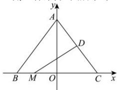

> [!faq]- 全练一本通解析
> **【答案】** D
>
> **【解析】**
> 解析：以 BC。所在直线为 x、轴、线段 BC。的中垂线为 y。轴建立平
> 解析:以 BC 所在直线为 x 轴, 线段 BC 的中垂线为 y 轴建立平面直角坐标系, 如图所示,
> 
> 由题意可知， $A(0,4)$ ， $C(3,0)$ ， $D\left(\frac{3}{2},2\right)$ ，
> 设 $M(t,0)$ ，其中 $t \in [-3,3]$ ，则 $\overrightarrow{MD} = \left(\frac{3}{2} - t, 2\right)$ ， $\overrightarrow{MC} = (3 - t, 0)$ ，故 $\overrightarrow{MD} \cdot \overrightarrow{MC} = \left(\frac{3}{2} - t\right) \times (3 - t) = t^2 - \frac{9}{2}t + \frac{9}{2} = \left(t - \frac{9}{4}\right)^2 - \frac{9}{16}$ ，
> 所以当 $t=\frac{9}{4}$ 时， $\overrightarrow{MD} \cdot \overrightarrow{MC}$ 有最小值 $-\frac{9}{16}$ .
>
> 故选 **D**.
