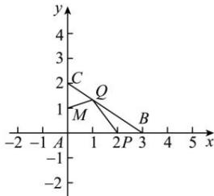

> [!faq]- 全练一本通解析
> **【答案】** （1） $\frac{1}{3}$ （2） $\left[-\frac{10}{13},3\right]$
>
> **【解析】**
> （1）因为 $\overrightarrow{AP}=\frac{2}{3}\overrightarrow{AB}$ ，所以 $\overrightarrow{BP}=\frac{1}{3}\overrightarrow{BA}$ ，
> 若点 Q 是 BC 边上靠近 C 的三等分点，则 $\overrightarrow{CQ}=\frac{1}{3}\overrightarrow{CB}$ ，即 $\overrightarrow{BQ}=\frac{2}{3}\overrightarrow{BC}$ ，
> 所以 $\overrightarrow{PQ}=\overrightarrow{BQ}-\overrightarrow{BP}=\frac{2}{3}\overrightarrow{BC}-\frac{1}{3}\overrightarrow{BA}=\frac{2}{3}\left(\overrightarrow{AC}-\overrightarrow{AB}\right)+\frac{1}{3}\overrightarrow{AB}=\frac{2}{3}\overrightarrow{AC}-\frac{1}{3}\overrightarrow{AB}$ ，
> 又 $\overrightarrow{PQ}=\lambda\overrightarrow{AB}+\mu\overrightarrow{AC}$ ， $\overrightarrow{AB}$ 、 $\overrightarrow{AC}$ 不共线，所以 $\left\{\begin{aligned}\lambda&=-\frac{1}{3}\\ \mu&=\frac{2}{3}\end{aligned}\right.$ ，所以 $\lambda+\mu=\frac{1}{3}$ 。
> （2）如图以 A 点为坐标原点建立平面直角坐标系，则 $B(3,0)$ ， $C(0,2)$ ， $P(2,0)$ ， $M(0,1)$ ，
> 因为 Q 在 CB 上，设 $\overrightarrow{CQ}=\lambda\overrightarrow{CB}=(3\lambda,-2\lambda)$ （ $\lambda\in[0,1]$ ），
> 所以 $\overrightarrow{MQ}=\overrightarrow{MC}+\overrightarrow{CQ}=(0,1)+(3\lambda,-2\lambda)=(3\lambda,-2\lambda+1)$ ， $\overrightarrow{PQ}=\overrightarrow{PC}+\overrightarrow{CQ}=(-2,2)+(3\lambda,-2\lambda)=(3\lambda-2,2-2\lambda)$ ，
> 所以 $\overrightarrow{MQ}\cdot\overrightarrow{PQ}=3\lambda(3\lambda-2)+(-2\lambda+1)(2-2\lambda)=13\lambda^{2}-12\lambda+2=13\left(\lambda-\frac{6}{13}\right)^{2}-\frac{10}{13}$ 因为 $\lambda\in[0,1]$ ，所以当 $\lambda=\frac{6}{13}$ 时， $\left(\overrightarrow{MQ}\cdot\overrightarrow{PQ}\right)_{\min}=-\frac{10}{13}$ ，
> 又 $\left|1-\frac{6}{13}\right|>\left|\frac{6}{13}-0\right|$ ，所以当 $\lambda=1$ 时， $\left(\overrightarrow{MQ}\cdot\overrightarrow{PQ}\right)_{\max}=3$ ，
> 所以 $\overrightarrow{MQ}\cdot\overrightarrow{PQ}\in\left[-\frac{10}{13},3\right]$ 。
> 
