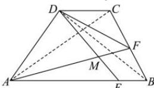
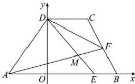

> [!faq]- 全练一本通解析
> **【答案】** （1） $\frac{\pi}{3}$ ; （2） $\frac{\sqrt{93}}{62}$ ; （3） $\left[\frac{95}{13},15\right]$
>
> **【解析】**
> （1）连接 AC，BD，
> 由 $AB \parallel CD, AB = 5, DC = 2$ ，
> 则 $\overrightarrow{AB} \parallel \overrightarrow{DC}, \overrightarrow{AB} = \frac{5}{2} \overrightarrow{DC}$ 所以 $\overrightarrow{AD}$ 与 $\overrightarrow{AB}$ 的夹角和 $\overrightarrow{AD}$ 与 $\overrightarrow{DC}$ 的夹角相同，并设为 $\theta, \theta \in (0, \pi)$ ，
> 则 $\overrightarrow{AC} \cdot \overrightarrow{BD} = (\overrightarrow{AD} + \overrightarrow{DC}) \cdot (\overrightarrow{AD} - \overrightarrow{AB}) = (\overrightarrow{AD} + \overrightarrow{DC}) \cdot (\overrightarrow{AD} - \frac{5}{2} \overrightarrow{DC}) = |\overrightarrow{AD}|^2 - \frac{3}{2} \overrightarrow{AD} \cdot \overrightarrow{DC} - \frac{5}{2} |\overrightarrow{DC}|^2 = |\overrightarrow{AD}|^2 - \frac{3}{2} |\overrightarrow{AD}| \cdot |\overrightarrow{DC}| \cdot \cos\theta - \frac{5}{2} |\overrightarrow{DC}|^2$ 又 $\overrightarrow{AC} \cdot \overrightarrow{BD} = 0$ ，即 $16 - \frac{3}{2} \times 4 \times 2 \cos\theta - \frac{5}{2} \times 4 = 0$ ，得 $\cos\theta = \frac{1}{2}$ ，
> 又 $\theta \in (0, \pi)$ ，则 $\theta = \frac{\pi}{3}$ ，即 $\angle DAB = \frac{\pi}{3}$ .
> 
> （2）如图, 过点 D 作 $DO \perp AB$ 于 O，
> 则 $AO = AD \cos \angle DAB = 2$ ， $DO = AD \sin \angle DAB = 2\sqrt{3}$ ，
> 故以 O 为原点，以 AB，DO 所在的直线分别为 x 轴，y 轴建立平面直角坐标系，
> 则 $A(-2,0)$ ， $D(0,2\sqrt{3})$ ， $E(2,0)$ ， $B(3,0)$ ， $C(2,2\sqrt{3})$ ，
> 又 F 为线段 BC 的中点，则 $F\left(\frac{5}{2},\sqrt{3}\right)$ 所以 $\overrightarrow{AF}=\left(\frac{9}{2},\sqrt{3}\right),\quad\overrightarrow{DE}=\left(2,-2\sqrt{3}\right)$
> 所以 $\cos\theta=\frac{\overrightarrow{AF}\cdot\overrightarrow{DE}}{\left|\overrightarrow{AF}\right|\cdot\left|\overrightarrow{DE}\right|}=\frac{\frac{9}{2}\times2-2\sqrt{3}\times\sqrt{3}}{\sqrt{\frac{81}{4}+3}\times\sqrt{4+12}}=\frac{\sqrt{93}}{62}$
> 
> （3）结合（2），得 $\overrightarrow{BC} = (-1, 2\sqrt{3})$ ,
> 设 $\overrightarrow{BF} = \lambda \overrightarrow{BC}$ ， $\lambda \in [0,1]$ ，则 $F\left(3 - \lambda ,2\sqrt{3}\lambda\right)$
> 所以 $\overrightarrow{AF} = (5 - \lambda, 2\sqrt{3}\lambda)$ ， $\overrightarrow{DF} = (3 - \lambda, 2\sqrt{3}\lambda - 2\sqrt{3})$ ，
> 所以 $\overrightarrow{AF} \cdot \overrightarrow{DF} = (5 - \lambda) \times (3 - \lambda) + 2\sqrt{3}\lambda \times (2\sqrt{3}\lambda - 2\sqrt{3}) = 13\lambda^2 - 20\lambda + 15$
> $$
> = 1 3 \left(\lambda - \frac {1 0}{1 3}\right) ^ {2} + \frac {9 5}{1 3}
> $$
> 又 $\lambda \in [0,1]$ ，则当 $\lambda = \frac{10}{13}$ 时， $(\overrightarrow{AF}\cdot \overrightarrow{DF})_{\min} = \frac{95}{13}$ ；当 $\lambda = 0$
> 时， $\left(\overrightarrow{AF}\cdot \overrightarrow{DF}\right)_{\max} = 15$
> 所以 $\overrightarrow{AF} \cdot \overrightarrow{DF}$ 的取值范围为 $\left[\frac{95}{13}, 15\right]$ .
