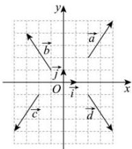

<!-- question-source:start -->
【6】（2023·全国高一随堂练习）如图，设 $\left\{\vec{i},\vec{j}\right\}$ 为一组标准正交基，用这组标准正交基分别表示向量 $\vec{a},\vec{b},\vec{c},\vec{d}$ ，并求出它们的坐标.

<!-- question-source:end -->

![[Q00009281A1]]
