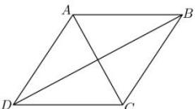

> [!faq]- 全练一本通解析
> **【答案】** $(-3,-5)$
>
> **【解析】**
> 
> $$
> \because \overrightarrow {A C} = (1, 3), \overrightarrow {A B} = (2, 4),
> $$
> $$
> \therefore \overrightarrow {A D} = \overrightarrow {B C} = \overrightarrow {A C} - \overrightarrow {A B} = (- 1, - 1),
> $$
> $$
> \therefore \overrightarrow {B D} = \overrightarrow {A D} - \overrightarrow {A B} = (- 3, - 5).
> $$
