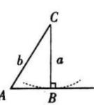
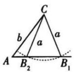
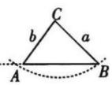
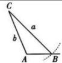
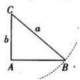

## 题型 3: 判断三角形的个数

已知三角形的两边和其中一边的对角, 不能唯一确定三角形的形状, 解这类三角形问题将出现无解、一解和两解三种情况, 应分情况予以讨论.
在 $\triangle ABC$ 中, 已知a, b和 $\angle A$ 时, 解的情况如下:
(1) 从代数角度分析
(1) 若 $\sin B = \frac{b \sin A}{a} > 1$ , 则满足条件的三角形的个数为0, 即无解;
(2) 若 $\sin B = \frac{b \sin A}{a} = 1$ , 则满足条件的三角形的个数为1;
(3) 若 $\sin B = \frac{b \sin A}{a} < 1$ , 则满足条件的三角形的个数为1或2.
显然由 $0 < \sin B = \frac{b \sin A}{a} < 1$ 可得 $\angle B$ 有两个值, 一个为钝角, 一个为锐角, 考虑到 “大边对大角” “三角形内角和等于 $180^{\circ}$ ” 等, 此时需进行讨论.

(2) 从几何角度分析

<table><tr><td colspan="3">∠A为锐角</td><td>∠A为钝角或者直角</td></tr><tr><td></td><td></td><td></td><td></td></tr><tr><td>a=bsinA</td><td>bsinAa≥ba&gt;b</td><td>a≥b</td><td>a&gt;b</td></tr><tr><td>一解</td><td>两解</td><td>一解</td><td>一解</td></tr></table>

上表中若 $\angle A$ 为锐角，当 $a < b \sin A$ 时无解；若 $\angle A$ 为钝角或直角，当 $a \leqslant b$ 时无解.

$\triangleright$ 角度1:判断三角形的个数问题

![[高中/课堂同步/题库/高中数学全练一本通/平面向量/第八节 正弦、余弦定理/题型 3_ 判断三角形的个数/questions/Q00005129.md]]

## $\triangleright$ 角度2:根据解的个数求参数

![[高中/课堂同步/题库/高中数学全练一本通/平面向量/第八节 正弦、余弦定理/题型 3_ 判断三角形的个数/questions/Q00005130.md]]
![[高中/课堂同步/题库/高中数学全练一本通/平面向量/第八节 正弦、余弦定理/题型 3_ 判断三角形的个数/questions/Q00005131.md]]
![[高中/课堂同步/题库/高中数学全练一本通/平面向量/第八节 正弦、余弦定理/题型 3_ 判断三角形的个数/questions/Q00005132.md]]
![[高中/课堂同步/题库/高中数学全练一本通/平面向量/第八节 正弦、余弦定理/题型 3_ 判断三角形的个数/questions/Q00005133.md]]
![[高中/课堂同步/题库/高中数学全练一本通/平面向量/第八节 正弦、余弦定理/题型 3_ 判断三角形的个数/questions/Q00005134.md]]
![[高中/课堂同步/题库/高中数学全练一本通/平面向量/第八节 正弦、余弦定理/题型 3_ 判断三角形的个数/questions/Q00005135.md]]
![[高中/课堂同步/题库/高中数学全练一本通/平面向量/第八节 正弦、余弦定理/题型 3_ 判断三角形的个数/questions/Q00005136.md]]
![[高中/课堂同步/题库/高中数学全练一本通/平面向量/第八节 正弦、余弦定理/题型 3_ 判断三角形的个数/questions/Q00005137.md]]
