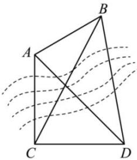

<!-- question-source:start -->
【73】(2023·高一课时练习)为了测量对岸 A、B 之间距离, 在此岸边选取了相距 1 千米的 C、D 两点, 并测得 $\angle ACD = 90^{\circ}, \angle BCD = 60^{\circ}, \angle BDC = 75^{\circ}$ , $\angle ADC = 45^{\circ}$ . 求 A、B 之间的距离.

<!-- question-source:end -->

![[Q00005150A1]]
