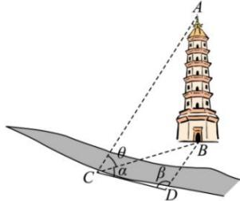

<!-- question-source:start -->
【74】(2023·山东临沂高一统考期中)如图,测量河对岸的塔高AB时,可以选取与塔底B在同一水平面内的两个测量基点C与D,现测得 $\angle BCD=75^{\circ}$ , $\angle BDC=45^{\circ}$ ,CD=20m,在点C测得塔顶A的仰角为 $30^{\circ}$ ,求塔高AB.

<!-- question-source:end -->

![[Q00005151A1]]
