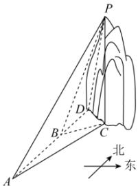

<!-- question-source:start -->
【76】(2021·山西朔州高一校考期中)如图,一条巡逻船由南向北行驶,在水平面上的A处测得山顶P在北偏东 $15^{\circ}$ （ $\angle BAC=15^{\circ}$ ，点C为点P在水平面上的射影)方向上,匀速向北航行20分钟到达B处,测得山顶P位于北偏东 $60^{\circ}$ 向上,此时测得山顶P的仰角为 $60^{\circ}$ ，已知山高为 $2\sqrt{3}$ 千米.
（1）求巡逻船的航行速度是每小时多少千米；
（2）若该船继续航行10分钟到达D处，问此时山顶P位于D处的南偏东什么方向？

<!-- question-source:end -->

![[Q00005153A1]]
