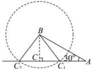

> [!faq]- 全练一本通解析
> **【答案】** C
>
> **【解析】**
> 解析:根据题意如下图所示:
> 
> 易知当 $BC \perp AC$ 时， $BC = AB\sin 30^\circ = 2$ ，若 $a = 2$ 满足条件的三角形只有一个；由题可知以 $B$ 为圆心， $a$ 为半径的圆与 $AC$ 边有两个交点时，即图中 $C_1, C_2$ 两点满足题意；所以可得 $BC < a < AB$ ，即 $2 < a < 4$ ；即 $a$ 的取值范围是 (2,4).
>
> 故选 **C**
