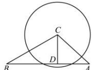

> [!faq]- 全练一本通解析
> **【答案】** B
>
> **【解析】**
> 解析: 由 $AC = b = 2\sqrt{3}$ , 要使三角形有两解, 就是要使以 $C$ 为圆心, 半径为 $2\sqrt{3}$ 的圆与 $BA$ 有两个交点,
> 过 $C$ 作 $CD \perp AB$ , 则 $|CD| = |BC|\sin B = a\sin B = \frac{1}{2} a$ ,
> 要使以 $C$ 为圆心, 半径为 $2\sqrt{3}$ 的圆与 $BA$ 有两个交点, 则需要 $|BC| > b > |CD| \Rightarrow a > 2\sqrt{3} > \frac{1}{2} a$ ,
> 解得 $a$ 的取值范围是 $2\sqrt{3} < a < 4\sqrt{3}$ . 故选: B.
> 
