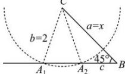

> [!faq]- 全练一本通解析
> **【答案】** C
>
> **【解析】**
> 解析:根据题意作图,如下图所示
> 
> 当 x 的值确定以后, 以 C 为圆心, 2 为半径的圆与 c 边的交点即为顶点 A 的位置,
> $$
> \angle C A B = 9 0 ^ {\circ}
> $$
> $$
> \frac {a}{\sin A} = \frac {b}{\sin B}
> $$
> $$
> x = 2 \sqrt {2}
> $$
> （2）圆过 B 时， $\angle CAB = 45^{\circ}$ ，三角形只有一个解，此时 x = 2；
> 所以当 $2 < x < 2\sqrt{2}$ 时，三角形有两个解，
> 所以 x 的取值范围为 $2 < x < 2\sqrt{2}$ .
>
> 故选 **C**.
