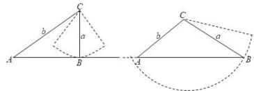

> [!faq]- 全练一本通解析
> **【答案】** D
>
> **【解析】**
> 解析: 在 $\triangle ABC$ 中, $\cos A = \frac{12}{13}$ , $\sin B = m$ , 若 $\angle C$ 有唯一解, 则 $\triangle ABC$ 有唯一解,
> 设内角 A, B, C 所对应的边分别为 a, b, c,
> 由 $\cos A = \frac{12}{13}$ ，则 A 为一确定的锐角且 $\sin A = \frac{5}{13}$ ，所以 $\frac{a}{b} = \frac{\sin A}{\sin B} = \frac{5}{13m}$ ，如图以 C 为圆心，a 为半径画圆弧，当圆弧与边 AB 有 1 个交点时满足条件，
> 如图示: 即圆弧与边 AB 相切或与圆弧与边 AB 相交有 2 个交点，
> 其中一个交点在线段 AB 的反向延长线上（或在点 A 处），故 $a=b\sin A=\frac{5}{13}b$ 或 $a\geq b$ 由 $\frac{a}{b}=\frac{5}{13m}$ ，即 $a=\frac{5}{13m}b$ ，得 $\frac{5}{13m}b=\frac{5}{13}b$ 或 $\frac{5}{13m}b\geq b$ 解得 m=1 或 $0<m\leq\frac{5}{13}$ . 故选：D.
> 
