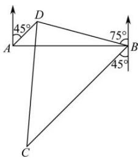

<!-- question-source:start -->
【72】某海域的东西方向上分别有 A, B 两个观测点（如图），它们相距 $25\sqrt{6}$ 海里。现有一艘轮船在 D 点发出求救信号，经探测得知 D 点位于 A 点北偏东 $45^{\circ}$ ，B 点北偏西 $75^{\circ}$ ，这时位于 B 点南偏西 $45^{\circ}$ 且与 B 相距 80 海里的 C 点有一救援船，其航行速度为 35 海里/小时。

（1）求 B 点到 D 点的距离 BD；
（2）若命令 C 处的救援船立即前往 D 点营救, 求该救援船到达 D 点需要的时间.

<!-- question-source:end -->

![[Q00009489A1]]
