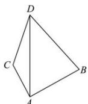

> [!faq]- 全练一本通解析
> **【答案】** （1）36海里（2）CD=4 $\sqrt{39}$ 海里
>
> **【解析】**
> 如图， $\angle DAB=75^{\circ}, \angle ADB=45^{\circ}, \angle DAC=30^{\circ}$
> 
> （1）在 $\Delta ABD$ 中， $\angle ABD = 60^{\circ}$ 由正弦定理得 $\frac{AB}{\sin\angle ADB} = \frac{AD}{\sin\angle ABD}$ $\therefore AD = \frac{AB\sin\angle ABD}{\sin\angle ADB} = \frac{12\sqrt{6}\sin 60^{0}}{\sin 45^{0}} = 36$ 海里
> （2）在 $\Delta ACD$ 中，由余弦定理得 $CD^{2} = AC^{2} + AD^{2} - 2AC\times AD\cos \angle DAC$ $= (8\sqrt{3})^{2} + 36^{2} - 2\times 8\sqrt{3}\times 36\times \frac{\sqrt{3}}{2} = 16\times 39$ $\therefore CD = 4\sqrt{39}$ 海里
