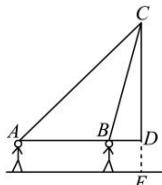

> [!faq]- 全练一本通解析
> **【答案】** （1） $4\sqrt{2}\mathrm{m}$ （2） $7.16\mathrm{m}$
>
> **【解析】**
> （1）在 △ABC 中， $\angle CAB = 45^\circ$ ， $\angle DBC = 75^\circ$ ，则 $\angle ACB = 75^\circ - 45^\circ = 30^\circ$ ， $AB = 4$ 。由正弦定理得 $\frac{BC}{\sin \angle CAB} = \frac{AB}{\sin \angle ACB}$ ，即 $\frac{BC}{\sin 45^\circ} = \frac{4}{\sin 30^\circ}$ ，解得 $BC = 4\sqrt{2} (\mathrm{m})$ 。即 $BC$ 的长为 $4\sqrt{2}\mathrm{m}$ 。
> 
> （2）在 $\triangle CBD$ 中， $\angle CDB = 90^{\circ}, BC = 4\sqrt{2}$
> 所以 $DC = 4\sqrt{2} \sin 75^{\circ}$ .
> $$
> \sin 7 5 ^ {\circ} = \sin (4 5 ^ {\circ} + 3 0 ^ {\circ}) = \sin 4 5 ^ {\circ} \cos 3 0 ^ {\circ} + \cos 4 5 ^ {\circ} \sin 3 0 ^ {\circ} = \frac {\sqrt {6} + \sqrt {2}}{4}
> $$
> 则 $DC = 2 + 2\sqrt{3}$
> 所以 $CE = ED + DC = 1.70 + 2 + 2\sqrt{3} \approx 3.70 + 3.464 \approx 7.16(\mathrm{m})$
> 即这棵桃树顶端点 C 离地面的高度为 7.16m.
