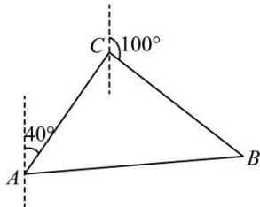

<!-- question-source:start -->
【77】（2018·四川高一校联考阶段练习）某渔船在航行中不幸遇险，发出呼叫信号，我海军舰艇在 A 处获悉后，立即测出该渔船在方位角（从指北方向顺时针转到目标方向线的水平角）为 $40^{\circ}$ ，距离为 15 海里的 C 处，并测得渔船正沿方位角为 $100^{\circ}$ 的方向，以 15 海里/小时的速度向小岛 B 靠拢，我海军舰艇立即以 $15\sqrt{3}$ 海里/小时的速度前去营救，求舰艇靠近渔船所需的最少时间和舰艇的航向.

<!-- question-source:end -->

![[Q00009494A1]]
