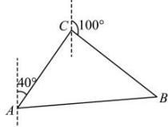

> [!faq]- 全练一本通解析
> **【答案】** 舰艇靠近渔船所需的最少时间为1小时, 舰艇航行的方位角为 $70^{\circ}$ .
>
> **【解析】**
> 设所需时间为 t 小时，利用余弦定理列出含有 t 的方程，再解方程得到 t 的值。再利用正弦定理求出 $\angle CAB = 30^{\circ}$ ，即得舰艇航行的方位角为 $70^{\circ}$ 。
> 详解:如图所示,设所需时间为 t 小时,
> 则 $AB = 15\sqrt{3} t, CB = 15t, \angle ACB = 120^{\circ}$ .
> 在 $\Delta ABC$ 中, 根据余弦定理, 则有
> $$
> A B ^ {2} = A C ^ {2} + B C ^ {2} - 2 A C \times B C \times \cos \angle A C B
> $$
> 可得 $\left(15\sqrt{3} t\right)^2 = 15^2 +\left(15t\right)^2 -2\times 15\times 15t\cos 120^\circ$
> 整理得 $2t^{2} - t - 1 = 0$
> 解得 t=1 或 $t=-\frac{1}{2}$ （舍去）.
> 即舰艇需 1 小时靠近渔船，
> 此时 $AB=15\sqrt{3}, BC=15$ ,
> 在 $\Delta ABC$ 中, 由正弦定理, 得 $\frac{BC}{\sin\angle CAB} = \frac{AB}{\sin\angle ACB}$ ,
> 所以 $\sin\angle CAB=\frac{BC\sin\angle ACB}{AB}=\frac{10\times\frac{\sqrt{3}}{2}}{10\sqrt{3}}=\frac{1}{2}$
> 又因为 $\angle CAB$ 为锐角，
> 所以 $\angle CAB = 30^{\circ}$ ,
> 所以舰艇航行的方位角为 $70^{\circ}$
> 
