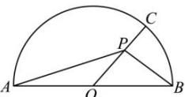

<!-- question-source:start -->
【10】如图, 半圆的直径 AB = 8, O 为圆心, C 为半圆上不同于 A, B 的任意一点, 若 P 为半径 OC 上的动点, 则 $\left(\overrightarrow{PA} + \overrightarrow{PB}\right) \cdot \overrightarrow{PC}$ 的最小值等于（）

A. -16 B. -8 C. -4 D. -2
<!-- question-source:end -->

![[Q00005011A1]]
