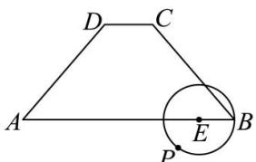
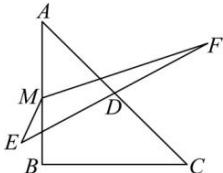

<!-- question-source:start -->
【16】（2024·陕西咸阳校考模拟预测）如图，在等腰梯形ABCD中， $AB \parallel CD, AB = 5, AD = 4, DC = 1, E$ 是线段AB上一点，且AE = 4EB，动点P在以E为圆心，1为半径的圆上，则 $\overrightarrow{DP} \cdot \overrightarrow{AC}$ 的最大值为（）

A. $\sqrt{3} -\sqrt{21}$ B. $2\sqrt{3} -6$ C. $\sqrt{21} -6$ D. $-\sqrt{3}$

第六节 专题: 求向量取值范围方法总结【17】（2023·福建高三）如图，在等腰直角三角形 ABC 中，斜边 $AC = 2\sqrt{2}$ ，M 为线段 AB 上的动点（包含端点），D 为 AC 的中点。将线段 AC 绕着点 D 旋转得到线段 EF，则 $\overrightarrow{ME} \cdot \overrightarrow{MF}$ 的最小值为（）

A. -2 B. $-\frac{3}{2}$ C. -1 D. $-\frac{1}{2}$
<!-- question-source:end -->

![[Q00005017A1]]
