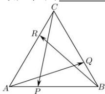

<!-- question-source:start -->
【18】(2023·天津)如图, 已知在边长为 2 的正三角形 ABC 中, 点 P, Q, R 分别在边 AB, BC, CA 上, 且 AP = BQ = CR , 则 $\overrightarrow{AQ} \cdot \overrightarrow{BR} + \overrightarrow{BR} \cdot \overrightarrow{CP} + \overrightarrow{CP} \cdot \overrightarrow{AQ}$ 的最大值为 \_\_\_\_.

<!-- question-source:end -->

![[Q00005018A1]]
