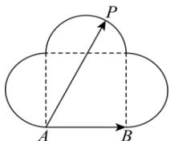

<!-- question-source:start -->
【28】(2023·山西校考模拟预测) 如图, 是由一个正方形和三个半圆组成的, 其中 A, B 是正方形的两个顶点, P 是三段圆弧上的动点, 若 AB = 4, 则 $\overrightarrow{AB} \cdot \overrightarrow{AP}$ 的取值范围是（）

A. $[-24, 24]$ B. $[-8, 24]$ C. $\left[-16\sqrt{2}, 16\sqrt{2}\right]$ D. $\left[-8, 16\sqrt{2}\right]$
<!-- question-source:end -->

![[Q00005027A1]]
