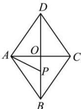

<!-- question-source:start -->
【11】如图, 边长为 2 的菱形 ABCD 的对角线相交于点 O, 点 P 在线段 BO 上运动, 若 $\overrightarrow{AB} \cdot \overrightarrow{BO} = -3$ , 则 $\overrightarrow{AP} \cdot \overrightarrow{BP}$ 的最小值为 \_\_\_\_.

<!-- question-source:end -->

![[Q00009349A1]]
