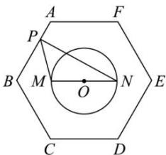

<!-- question-source:start -->
【13】(2023·河南高一校联考) 正六边形 $ABCDEF$ 的边长为 4, 圆 $O$ 的圆心为该正六边形的中心, 圆 $O$ 的半径为 2, 圆 $O$ 的直径 $MN \parallel CD$ , 点 $P$ 在正六边形的边上运动, 则 $\overrightarrow{PM} \cdot \overrightarrow{PN}$ 的最大值为 ( )

A. 9 B. 10 C. 11 D. 12
<!-- question-source:end -->

![[Q00009351A1]]
